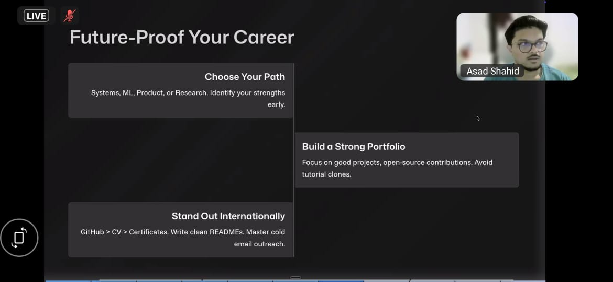
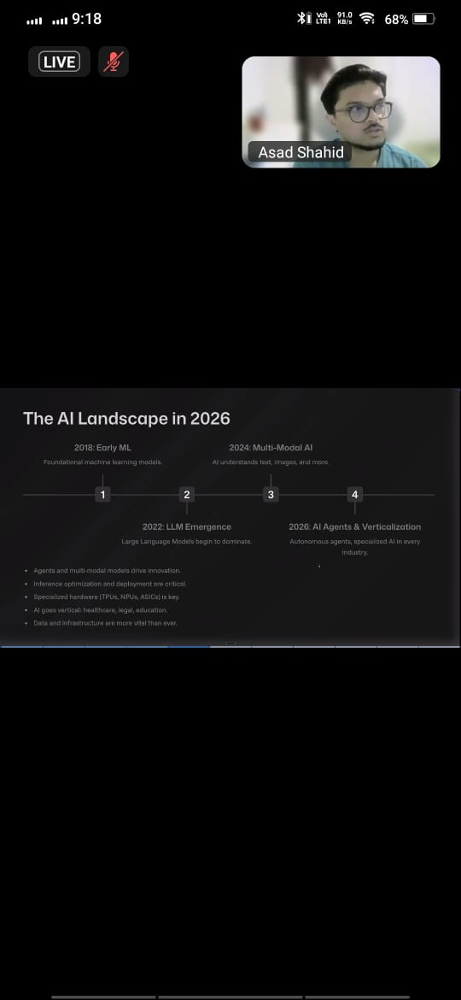
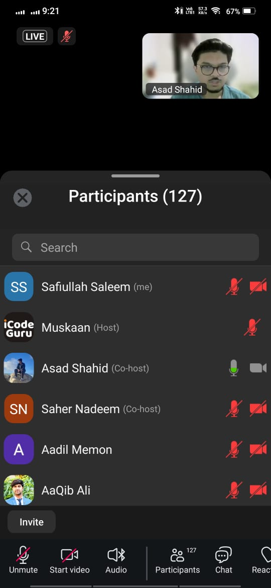
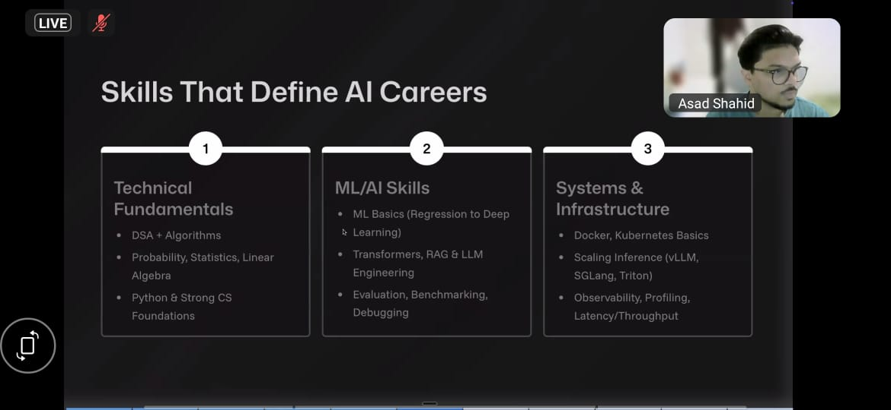
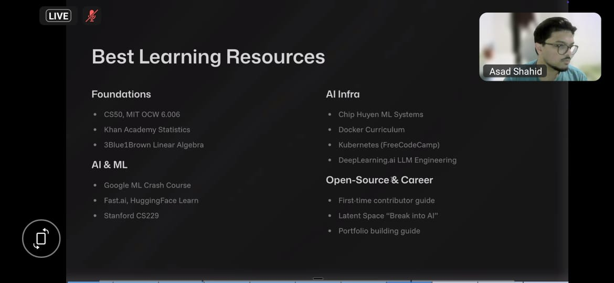
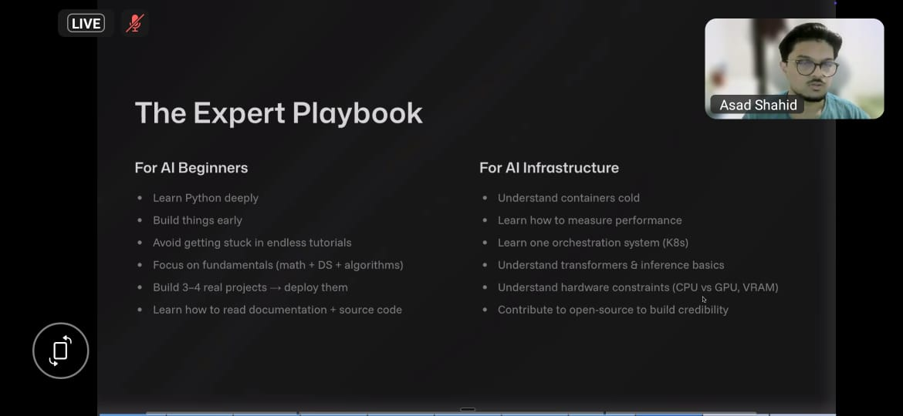

Just met a guy who's basically writing the playbook for modern tech careers.

Honestly, sometimes you attend a webinar and it just… clicks.

I was in an iCodeGuru session with Asad Shahid , and I walked away with my notebook full. Not with complex jargon, but with a crystal-clear picture of what a truly impactful career in tech looks like right now.

Here’s what stuck with me:

1. The "Build in Public" Mindset is Real.
While doing his degree at Berkeley, he’s not just studying he’s contributing to NVIDIA Dynamo. That’s the open-source framework that powers AI for companies like Perplexity and Cohere. He didn't wait for permission or a fancy title. He read the code, found a gap, and started writing documentation (500+ lines!) and fixing bugs. It hit me: you learn the most by building where everyone can see.

2. Your Superpower is in the Mix.
He’s not just a Data Science major. He’s also got a Certificate in Entrepreneurship. That combo is everything. It means he can build the model and understand the problem it solves for real people. It’s a reminder: the most interesting solutions happen at the intersection.

3. Lift as You Climb. Seriously.
He’s the Head of Professional Development at the Muslim Tech Collaborative at University of California, Berkeley. Instead of hoarding knowledge, he’s building a pipeline for others. It made me think: a career is a solo journey until you make it a team sport. True growth is about pulling people up with you.

The most practical part? His simple 4-step learning hack:

Narrow it down: Stop trying to learn "cloud." Learn "how to deploy a model on Kubernetes" this week.

Find the one good resource: Don't drown in 50 tabs. Find the best tutorial, the key repo, or the foundational paper. Quality wins.

Build something tiny, NOW: Knowledge decays fast. Use it in a small project immediately. He does this at HPE, in his research, everywhere.

Write it down like you're teaching a friend: Documenting what you learned isn't busywork. It’s how you make it stick and help the person behind you.

The biggest takeaway wasn't technical. It was this: Your learning speed and your willingness to add value to the community are your new resume.

Shoutout to iCodeGuru and the awesome mentors Sir Zafar Shahid, PhD, Sir Rizwan Ghaffar, and Sir Amir Khan for making these conversations happen. These sessions are gold.

Feeling inspired. How do you all keep your skills sharp and make your work count for more than just a paycheck?

## Screenshots

